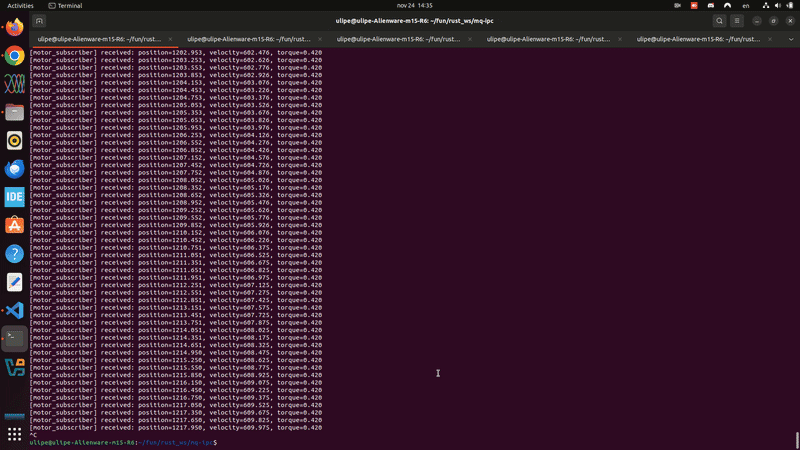

# `mq-ipc` — Lightweight Publish/Subscribe IPC on POSIX Mqueues

[](https://github.com/uLipe/mq-ipc/actions/workflows/ci.yml)



`mq-ipc` (or **MqIPC**) is a fast, minimal, zero-dependency publish/subscribe IPC system built on **POSIX mqueues**.
It is designed for embedded Linux, robotics, industrial automation, and distributed control systems where:

* deterministic message delivery matters,
* you want a simple topic-based API,
* multiple **processes** must exchange typed data,
* and optionally, messages must flow over a **physical transport** (CAN, Serial, UDP, etc).

### *(with optional wire mirroring for distributed systems)*

MqIPC gives you **local typed pub/sub**, **system-wide topics**, and an optional **wire mirroring layer** that can export/import topics over any physical link.

---

# Features

### 1. Strongly-Typed Local Topics

You can create typed topics such as:

```rust
Topic<MotorState>::new("/motor/state", 16)?;
```

Each process that opens the same topic name receives the same shared queue.

Subscribers within the same process receive the message via a callback-based fan-out system.

### 2. System-Wide Communication

All topics use **POSIX mqueues**, which are globally visible in the OS.
Any process can:

* publish to a topic,
* subscribe to a topic,
* or detect if the topic exists.

### 3. Wire Mirroring (optional)

Use `WireTx<T>` instead of `Topic<T>` to automatically **mirror** each publish into a special internal topic (`/ipc_tx`) that other processes can forward over external links.

Your application publishes normally → MqIPC mirrors the change into `/ipc_tx`.

From there, you can bridge to:

* SocketCAN
* Serial ports
* TCP/UDP
* Shared memory
* Anything you want

### 4. Wire RX Routing (optional)

On the receiving side (CAN/Serial/etc), you can reconstruct a `WirePacket` and drop it back into the correct **local topic** automatically:

* If the topic exists → publish the payload
* If it does not exist → ignore cleanly

No registry required.
Topics act as their own discovery mechanism.

---

# Installation

Add to your `Cargo.toml`:

```toml
[dependencies]
mq-ipc = { path = "." }
```

---

# Quick Start

## 1. Define a message type

```rust
#[repr(C)]
#[derive(Copy, Clone, Debug, Pod, Zeroable)]
pub struct MotorState {
    pub position: f32,
    pub velocity: f32,
    pub torque: f32,
}
```

---

# Local Typed IPC

## Publisher: `Topic<T>`

```rust
use mqueue_ipc::Topic;

let motor = Topic::<MotorState>::new("/motor/state", 16)?;

motor.publish(&MotorState {
    position: 1.0,
    velocity: 2.0,
    torque: 0.5,
}, 1, 0)?;
```

## Subscriber

```rust
motor.subscribe(|state: MotorState| {
    println!("Received: {:?}", state);
});
```

This works across **multiple processes**:
anything that opens `/motor/state` receives the same shared queue.

---

# Wire Mirroring (Distributed IPC)

Use `WireTx<T>` instead of `Topic<T>`:

```rust
use mqueue_ipc::wire::WireTx;

let motor = WireTx::<MotorState>::new("/motor/state", 16)?;
motor.publish(&state)?; // publishes locally + mirrors to /ipc_tx
```

Every publish becomes:

* a normal message to `/motor/state`
* a serialized `WirePacket` forwarded to `/ipc_tx`

---

# Wire TX Example (Router / Bridge)

Example router that listens on `/ipc_tx` and forwards packets over CAN:

```rust
let tx_topic = open_ipc_tx(32)?;
tx_topic.subscribe(|pkt: WirePacket| {
    write_to_can(pkt);
});
```

The crate ships with a real example using **SocketCAN**:

```
examples/router_rx_socketcan.rs
```

---

# Wire RX Example (Distributed Routing)

When receiving a `WirePacket` from CAN/Serial:

```rust
fn dispatch_to_local_topic(pkt: &WirePacket) -> io::Result<()> {
    let topic_name = pkt.topic_name();
    if topic_name.is_empty() {
        return Ok(());
    }

    if let Ok(Some(topic)) = MqTopic::open_existing(&topic_name) {
        let msg = Msg::new(0, &pkt.data[..pkt.payload_len as usize]);
        topic.publish(&msg, 0)?;
    }

    Ok(())
}
```

This gives you a **distributed publish/subscribe network**
where topics jump between machines or processes effortlessly.

---

# Why MqIPC?

MqIPC is designed for:

* deterministic behavior
* multi-process embedded systems
* zero-copy typed messaging
* low overhead
* easy distributed extension
* no brokers, no registries, no XML/IDL layers

Just **POSIX mqueue + typed wrappers + optional wire framing**.

---

# Examples Included

| Example                  | Description                                                     |
| ------------------------ | --------------------------------------------------------------- |
| `motor_publisher.rs`     | Typed topic with WireTx reflection                              |
| `router_tx.rs`           | Reads `/ipc_tx` and prints wire packets                         |
| `motor_subscriber.rs` | Receives wire packets from another process and prints |

---

# Getting Started

This section shows the fastest way to try **MqIPC** using the built-in examples.
You only need a POSIX system with support for **POSIX mqueues** (Linux, WSL2, *BSD, ESP-IDF, etc).

---

## 1. Compile the project

```bash
git clone https://github.com/uLipe/mq-ipc.git
cd mq-ipc
cargo build
```

---

## 2. Run the Subscriber (listener)

Open **terminal 1**:

```bash
cargo run --example motor_subscriber
```

Expected output:

```
motor_subscriber: listening on topic /motor/state
```

As soon as messages arrive, you will see logs like:

```
[motor_subscriber] received: position=1.000, velocity=2.000, torque=0.500
```

---

## 3. Run the Publisher

Open **terminal 2**:

```bash
cargo run --example motor_publisher
```

This example publishes a `MotorState` struct into the topic `/motor/state` once per second.
You should now see the subscriber printing live updates.

---

## 4. What’s happening under the hood?

* Both examples open the system-wide mqueue `/motor/state`.
* The publisher sends `MotorState` values via `Topic<MotorState>::publish()`.
* The subscriber registers a callback via `subscribe(...)`.
* A background worker thread inside `Topic<T>` receives messages from the mqueue and dispatches them to the callback(s).
* Because POSIX mqueues are **global**, the two programs communicate even though they're separate processes.

This validates the entire IPC stack:

1. Typed messages (`MotorState`)
2. Encoding through `Msg`
3. POSIX `mq_open`, `mq_send`, `mq_receive`
4. Worker dispatch thread
5. Fan-out callback

---

## 5. Cleaning up (optional)

To inspect message queues:

```bash
ls -l /dev/mqueue
```

To delete a queue manually:

```bash
sudo rm /dev/mqueue/motor/state
```

or via code:

```rust
mq_unlink("/motor/state");
```
---

## Cross-Compiling for AArch64 Linux

This project can be cross-compiled for 64-bit ARM Linux systems (e.g., embedded boards running aarch64 Linux).
The instructions below describe the recommended setup for cross-compiling on an x86_64 host targeting `aarch64-unknown-linux-gnu`.

> **Note:** The steps for ARMv7-A (`armv7-unknown-linux-gnueabihf`) are similar.
> Replace the target triple and toolchain names accordingly.

---

### 1. Install the Rust target

```bash
rustup target add aarch64-unknown-linux-gnu
```

---

### 2. Install the cross C toolchain

On Debian/Ubuntu:

```bash
sudo apt-get update
sudo apt-get install gcc-aarch64-linux-gnu
```

This provides the linker (`aarch64-linux-gnu-gcc`) and associated libc for the target.

---

### 3. Configure Cargo to use the correct linker

Create or edit the file:

```
.cargo/config.toml
```

and add:

```toml
[target.aarch64-unknown-linux-gnu]
linker = "aarch64-linux-gnu-gcc"
```

This ensures Rust links the final binary using the correct cross toolchain.

---

### 4. Build for AArch64

To build the library and binaries:

```bash
cargo build --release --target aarch64-unknown-linux-gnu
```

To also build the project examples:

```bash
cargo build --release --target aarch64-unknown-linux-gnu --examples
```

All output artifacts will be located under:

```
target/aarch64-unknown-linux-gnu/release/
target/aarch64-unknown-linux-gnu/release/examples/
```

---

### 5. Deploying to the board

Transfer the resulting binary to the target device:

```bash
scp target/aarch64-unknown-linux-gnu/release/<binary> user@<board-ip>:/tmp/
```

Then run it on the board:

```bash
ssh user@<board-ip>
chmod +x /tmp/<binary>
/tmp/<binary>
```

The board must have:

* A Linux kernel with POSIX message queue support (`CONFIG_POSIX_MQUEUE`)
* `/dev/mqueue` mounted (typically automatic; otherwise mount using `mount -t mqueue none /dev/mqueue`)
* Any optional subsystems you intend to use, such as SocketCAN

---
